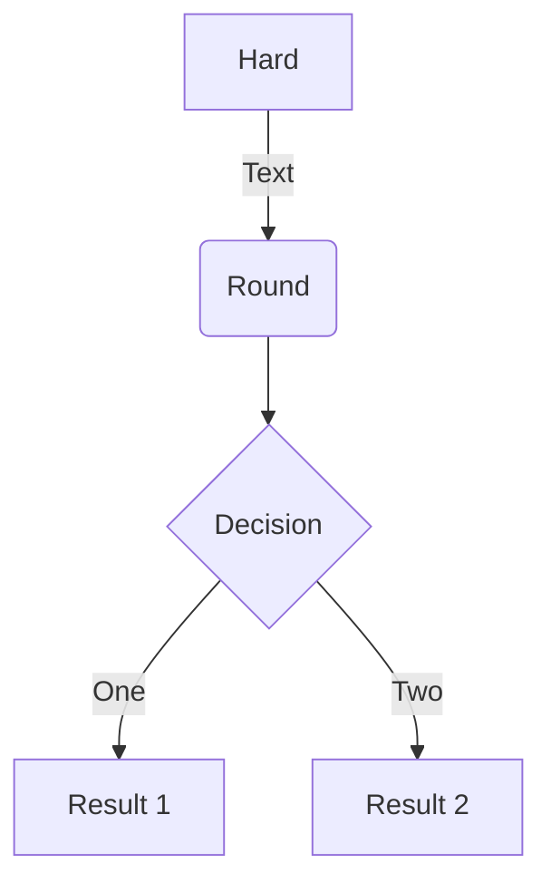

## Common
### Basic
```python
import foo.bar
```

### With Title 
```python title="sample.py"
import foo.bar
```

### No Copy
``` { .python .no-copy }
import foo.bar
```

### Code block with annotation
``` yaml
theme:
  features:
    - content.code.annotate # (1)
```

1.  :man_raising_hand: I'm a code annotation! I can contain `code`, __formatted
    text__, images, ... basically anything that can be written in Markdown.


### Code block with annotation, stripped
``` yaml
# (1)!
```

1.  Look ma, less line noise!


### Embedding external files
```
--8<-- ".browserslistrc"
```

## Line Number
### Basic
```{.python linenums="1"}
import foo.bar
```

### Highlighting inline code blocks
The `#!python range()` function is used to generate a sequence of numbers.

### Custom Line Number Start
```{.python linenums="2"}
import foo.bar
```

### Nth Line
``` {.python linenums="1 2"}
"""Some file."""
import foo.bar
import boo.baz
import foo.bar.baz
```

### Special Lines
``` {.python linenums="1 1 2"}
"""Some file."""
import foo.bar
import boo.baz
import foo.bar.baz
```

## Highlight Lines
### Basic
```{.python hl_lines="1 3"}
"""Some file."""
import foo.bar
import boo.baz
import foo.bar.baz
```

### Highlight Lines with Line Numbers
```{.py3 hl_lines="1 3" linenums="1"}
"""Some file."""
import foo.bar
import boo.baz
import foo.bar.baz
```

### Highlight Ranges
```{.py3 hl_lines="1-2 5 7-8"}
import foo
import boo.baz
import foo.bar.baz

class Foo:
   def __init__(self):
       self.foo = None
       self.bar = None
       self.baz = None
```

### Highlight Ranges With Line Numbers
```{.py3 hl_lines="7-8" linenums="1"}
import foo
import boo.baz
import foo.bar.baz

class Foo:
   def __init__(self):
       self.foo = None
       self.bar = None
       self.baz = None
```


## Title
### Adding Titles
```{.py3 title="My Cool Header"}
import foo.bar
import boo.baz
import foo.bar.baz
```

### Automatic Titles
```python
import foo.bar
import boo.baz
import foo.bar.baz
```


### Undesired Automatic Title
```pycon
>>> 3 + 3
6
```


## Custom Fences
### Flow Chart


## Diff Comparer
``` {  .diff .title="" .no-copy  linenums="1"} 
- list1 = [15, 32, 4, 32, 99]
+ list1 = [10, 20, 4, 45, 99]

mx = max(list1[0], list1[1]) 
secondmax = min(list1[0], list1[1]) 
n = len(list1)
for i in range(2,n): 
-	# sample comment
	if list1[i] > mx: 
		secondmax = mx
		mx = list1[i] 
	elif list1[i] > secondmax and \
		mx != list1[i]: 
		secondmax = list1[i]
	elif mx == secondmax and \
		secondmax != list1[i]:
		secondmax = list1[i]

print("Second highest number is : ",\
	str(secondmax))

```

## Folder Tree

### Basic

``` {  .sh .title="" .no-copy  linenums="1"}
.
├─ .icons/                             # Bundled icon sets
├─ assets/
│  ├─ images/                          # Images and icons
│  ├─ javascripts/                     # JavaScript files
│  └─ stylesheets/                     # Style sheets
├─ partials/
│  ├─ integrations/                    # Third-party integrations
│  │  ├─ analytics/                    # Analytics integrations
│  │  └─ analytics.html                # Analytics setup
│  ├─ languages/                       # Translation languages
│  ├─ actions.html                     # Actions
│  ├─ alternate.html                   # Site language selector
│  ├─ comments.html                    # Comment system (empty by default)
│  ├─ consent.html                     # Consent
│  ├─ content.html                     # Page content
│  ├─ copyright.html                   # Copyright and theme information
│  ├─ feedback.html                    # Was this page helpful?
│  ├─ footer.html                      # Footer bar
│  ├─ header.html                      # Header bar
│  ├─ icons.html                       # Custom icons
│  ├─ language.html                    # Translation setup
│  ├─ logo.html                        # Logo in header and sidebar
│  ├─ nav.html                         # Main navigation
│  ├─ nav-item.html                    # Main navigation item
│  ├─ pagination.html                  # Pagination (used for blog)
│  ├─ palette.html                     # Color palette toggle
│  ├─ post.html                        # Blog post excerpt
│  ├─ progress.html                    # Progress indicator
│  ├─ search.html                      # Search interface
│  ├─ social.html                      # Social links
│  ├─ source.html                      # Repository information
│  ├─ source-file.html                 # Source file information
│  ├─ tabs.html                        # Tabs navigation
│  ├─ tabs-item.html                   # Tabs navigation item
│  ├─ tags.html                        # Tags
│  ├─ toc.html                         # Table of contents
│  ├─ toc-item.html                    # Table of contents item
│  └─ top.html                         # Back-to-top button
├─ 404.html                            # 404 error page
├─ base.html                           # Base template
├─ blog.html                           # Blog index page
├─ blog-archive.html                   # Blog archive index page
├─ blog-category.html                  # Blog category index page
├─ blog-post.html                      # Blog post page
└─ main.html                           # Default page
```


### File Tree Plugin

``` { .tree title="test", base="http://localhost:8000/samples/files/group-models/001/" }
.
    samples/ {download-7Z=samples.7z, download-zip=samples.zip, download-rar=samples.rar, download-targz=samples.tar.gz}
        ApexSolutions.yaml {view=ApexSolutions.yaml}
        NeptuneDev.yaml
        OrionTech.yaml
        PinnacleSoftware.yaml
        QuantumProjects.yaml
        StratosSystems.yaml
        VertexInnovations.yaml
```